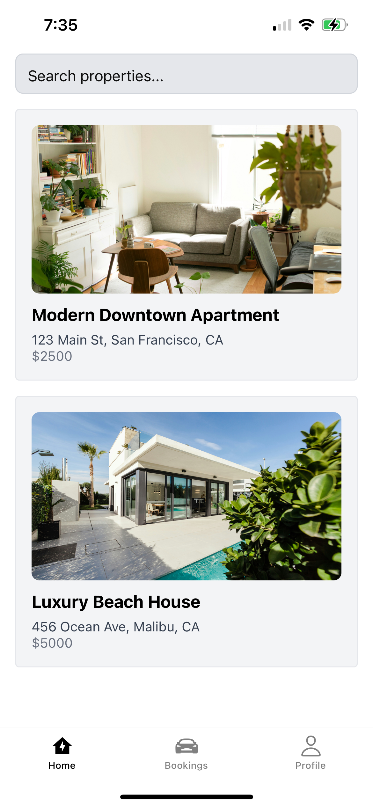
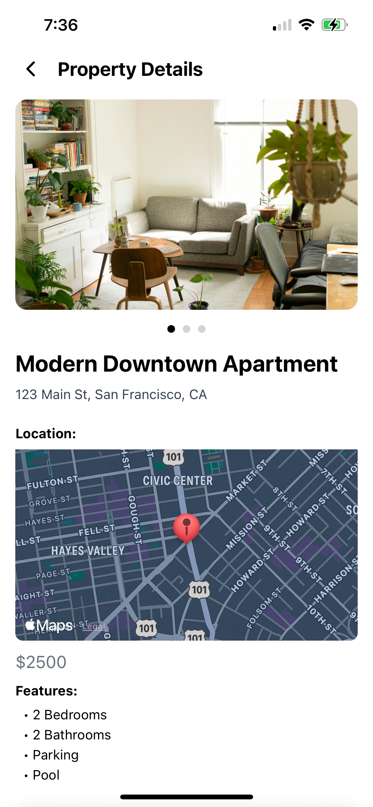
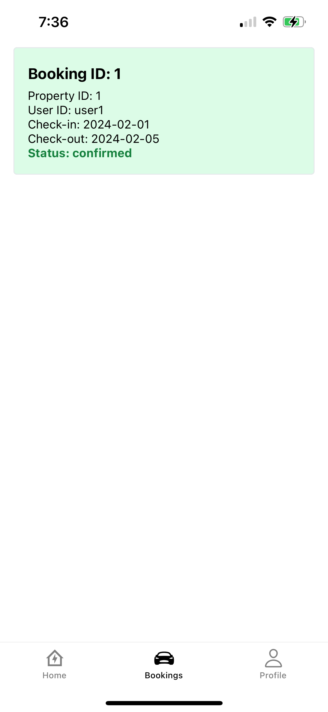
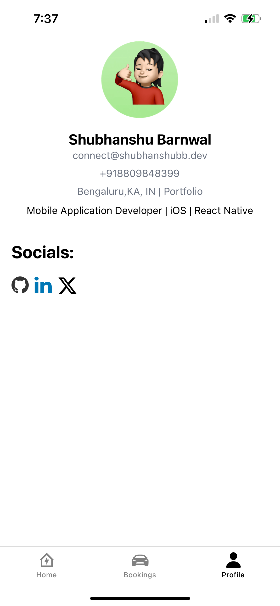

# Welcome to your Expo app 👋

This is an [Expo](https://expo.dev) project created with [`create-expo-app`](https://www.npmjs.com/package/create-expo-app).

## Get started

1. Install dependencies

   ```bash
   npm install
   ```

2. Start the app

   ```bash
   npx expo start
   ```

In the output, you'll find options to open the app in a

- [development build](https://docs.expo.dev/develop/development-builds/introduction/)
- [Android emulator](https://docs.expo.dev/workflow/android-studio-emulator/)
- [iOS simulator](https://docs.expo.dev/workflow/ios-simulator/)
- [Expo Go](https://expo.dev/go), a limited sandbox for trying out app development with Expo

You can start developing by editing the files inside the **app** directory. This project uses [file-based routing](https://docs.expo.dev/router/introduction).

## Get a fresh project

When you're ready, run:

```bash
npm run reset-project
```

This command will move the starter code to the **app-example** directory and create a blank **app** directory where you can start developing.

## Learn more

To learn more about developing your project with Expo, look at the following resources:

- [Expo documentation](https://docs.expo.dev/): Learn fundamentals, or go into advanced topics with our [guides](https://docs.expo.dev/guides).
- [Learn Expo tutorial](https://docs.expo.dev/tutorial/introduction/): Follow a step-by-step tutorial where you'll create a project that runs on Android, iOS, and the web.

## Join the community

Join our community of developers creating universal apps.

- [Expo on GitHub](https://github.com/expo/expo): View our open source platform and contribute.
- [Discord community](https://chat.expo.dev): Chat with Expo users and ask questions.

# Property Listing App

A robust React Native property listing app built with Expo, TypeScript, expo-router, twrnc (Tailwind for React Native), Zustand, and React Query. The app demonstrates clean architecture, API integration, state management, and a modern UI/UX.

## Folder Structure

```
property-app/
├── app/
│   ├── (tabs)/
│   │   ├── _layout.tsx         # Tab navigation layout
│   │   ├── index.tsx           # Home screen
│   │   ├── bookings.tsx        # Bookings tab
│   │   ├── profile.tsx         # Profile tab
│   ├── property/
│   │   └── details.tsx         # Property details stack screen
│   └── _layout.tsx             # Root layout (if present)
├── assets/                     # Images, fonts, etc.
├── components/                 # Reusable UI components
├── constants/                  # App-wide constants
├── hooks/                      # Custom React hooks
├── store/
│   └── bookingStore.ts         # Zustand store for bookings and userId
├── utils/
│   └── api.ts                  # Axios instance for API calls
├── db.json                     # JSON-server database
├── package.json
├── tailwind.config.js
├── README.md
└── ... (other config files)
```

## Features
- Home screen with property list, search bar, and image.

- Property details screen with image slider, map view, features with icons, and booking functionality

- Bookings tab showing both API and locally added bookings, with cancel feature and confirmation

- Profile tab with user info and social links

- State management using Zustand
- API integration using React Query and Axios
- Navigation using expo-router (tabs + stack)
- Styling with twrnc (Tailwind for React Native)

## How to Run

### Prerequisites
- Node.js & npm
- Expo CLI (`npm install -g expo-cli`)
- Android Studio (for emulator)

### 1. Install dependencies
```sh
npm install
```

### 2. Start the local API server
Download `db.json` from the assignment or use the provided one, then run:
```sh
npx json-server --watch db.json --port 3001
```

### 3. Start the Expo app
```sh
npm run android
```
- This will open the Expo Go app in your Android emulator.
- If you have multiple emulators/devices, select the desired one in the Expo CLI prompt.

### 4. (Optional) Start for iOS or Web
```sh
npm run ios   # for iOS simulator
npm run web   # for web
```

## Assumptions
- The user is always logged in as a default user (`user1`), but you can change the userId in the Zustand store for testing.
- Bookings made in the app are stored locally (Zustand) and not persisted to the API.
- The API server (json-server) must be running for the app to fetch properties/bookings/profile.
- The app is designed for demonstration and assessment purposes, not production.

## Additional Instructions
- To change the user, use `useBookingStore.getState().setUserId('newUserId')` in the console or add a UI for it.
- If you want to reset local bookings, reload the app or clear Zustand state.
- If you encounter network issues, ensure your emulator can access `localhost:3001` (use your machine's IP if needed).
- All styling is done with twrnc (Tailwind for React Native). Make sure it's installed and configured.
- For any issues with maps, ensure `react-native-maps` is installed and linked (Expo handles this automatically).

## Reviewer Notes
- The codebase is modular and follows best practices for Expo + TypeScript projects.
- All requirements from the assignment are implemented, including navigation, state management, API integration, and UI/UX.
- Please see the code comments for further explanations.

---

Feel free to reach out for any questions or clarifications!
